# 109-2 NTUEE Web Programming Hackathon #2 - Merging School Game

Please first refer to the "merging school" version of the traditional 2048 game. [[original reference](https://www.cool3c.com/article/146563)] [[demo video]](https://youtu.be/jzsxvO4T1yM)</br>

If you have never played 2048, it is recommended that you try it first (but do not waste time going through its code ^^. I CAN PROMISE THAT IT IS COMPLETELY FUTILE)! [[play 2048]](https://play2048.co/) [[play merge school](https://splitline.github.io/merge-simulator/)]</br>

*And don't worry about the complicated algorithms such as combination of grids, random position generation, and etc., because those functions are already provided for you!*

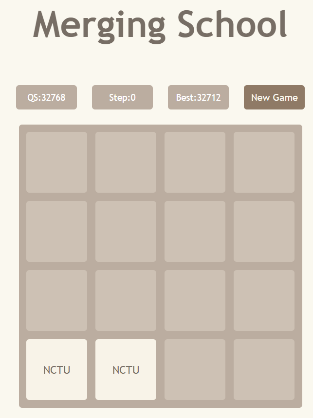

## Get started before hackathon

1. Please make sure that you have done everything mentioned in "[preREADME.md](https://hackmd.io/m3u1TEtrRLKQW4diD1-pmg?view)" and have the "hack2" project ready.


2. Download  `hack2-hook-exam.zip`  or `hack2-nohook-exam.zip` from Ceiba, depending on your favor on using or not using React Hooks. Directly uncompress it under the `/wp1092/hack2/` folder, and it will extract and overwrite this README file, cypress related scripts, images in "imgs", the "public" directory, and boilerplate JavaScript codes in "src" here. 

```
cd hack2
// Download "hack2-xxx-exam.zip" from Ceiba
unzip hack2-hook-exam.tgz    or
unzip hack2-nohook-exam.tgz
```

3. The file hierarchical structure should look like:
```
wp1092
├── hack2
|   |── .gitignore
|   |── README.md
│   ├── cypress
│   │   └── ...
│   ├── cypress.json
│   ├── imgs
│   │   └── ...
│   ├── node_modules
│   │   └── ...
│   ├── package.json
│   ├── public
│   │   └── ...
│   ├── src
│   │   ├── components
│   │   │   ├── Board2048.js
│   │   │   ├── Grid.js
│   │   │   ├── Header.js
│   │   │   └── Row.js
│   │   ├── containers
│   │   │   ├── MergeSchool.css
│   │   │   └── MergeSchool.js
│   │   ├── App.css
│   │   ├── App.js
│   │   └── ...
│   └── ...
└── ...
```
4. Watch the demo video and the requirements.
5. Have fun at this hackathon!
6. **The server will be run on port 4000.** Make sure you have closed the application on port 4000, if any. 

## Files structure of this project
* The file structure of the JavaScript codes is as the following:</br>
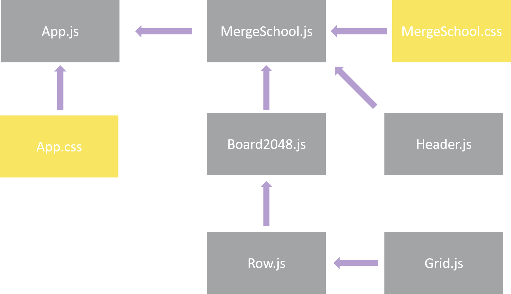

* The corresponding values of the 16 grids are stored in a 2D matrix as the following figure. "0" stands for the empty grid while the other numbers represent the corresponding level in traditional 2048 game.</br>
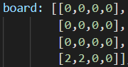

## Warnings

Violation of any of the following rules, will result in deduction in points. Please pay attention to them.

1. Only `MergeSchool.js`, `Board2048.js`, `Grid.js`, `Header.js`, and `Row.js` are allowed to be modified. Any revision to other files is not allowed and would trigger error.

2. If you are asked to add a specified `id` to one element, you should add it accordingly because the testing script would trace these ids. Also, you should NOT revise any `id` if there is no such demand in the description.

3. The restriciton in the `class` name of the elements is the same as the aforementioned rule.

4. Albeit some of the subproblems can be done independently, most of the them would depend on multifarious functions that should be implemented in the previous subproblems. That's, the subproblem `#9` requires the completion of `#8 #7 #6...`, etc. You should complete the subproblems one by one in the specified sequenence. **We will assume that you do complete all the previous subproblems during testing and grading on any subproblem.**

5. Never revise the `Pseudo random number generator` function and its usage in the `putGridRandom` function!

6. **Only 1/30 sec is tolerated for every movement or button click. For some of the features, you should correctly deal with the react lifecycle or utilize "useEffect" hook!**

7. **Basically, no partial credit will be given for each subproblem.**

8. **Your listener for keydown event must be on the body or you will not get the score. That's:**
```javascript
body = document.querySelector('body')
```

## Useful buttons
Do you find that there are two secret buttons in the bottom? The one named `BadEnd` will directly navigate you to the sceranio of losing the game while the `GoodEnd` will be one with the winning of the game. You are encouraged to leverage them to test your implementation in some of the subproblems. Please note that these two functions would not reset the `step` and `QS` but just modify the current board.

## Requirements
### Easy (50% in total)
1. **[Easy] Show the values of 16 grids ("0" should be hidden) according to the board matrix with corresponding id `grid-i-j` with a child that has id `value-i-j` (5%)**
    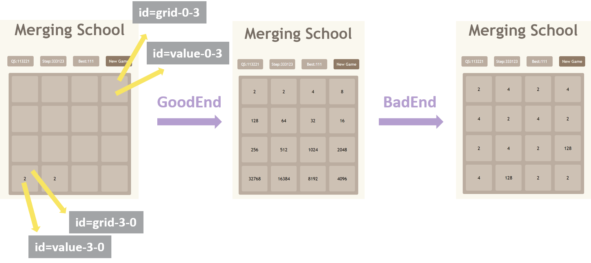
    * React components will be erroneously rendered unless you finish this subproblem. That's, you will see something as the following if you have not started doing anything.
    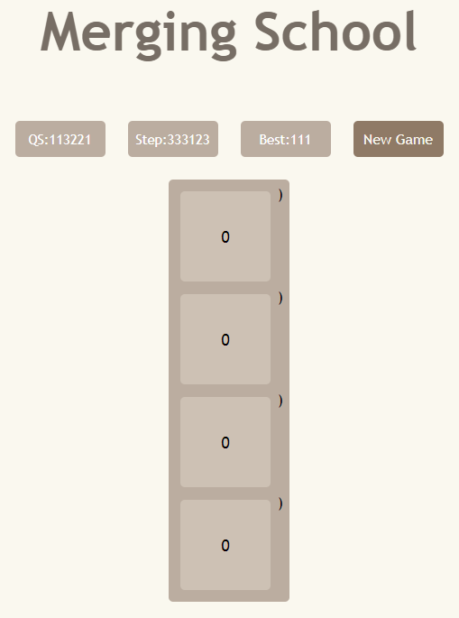
   * Show all the 16 grids with the corresponding value in the 4*4 matrix. However, "0" should be hidden.
    * Assign the `gird_id` and `value_id` according to the index in the 2D matrix. That's, the variable `grid_id` should be `grid-{$row}-{$column}` and `value_id` should be `value-{$row}-{$column}`. Both the row and the column idx start from 0 and end in 3.
    ```javascript
    <td>
        <div className={temp_class_name} id={grid_id}>
            <div className="school-name" id={value_id}>0</div>
        </div>
    </td>
    ```
    * For example, the `2` in the following matrix should be in the grid with id `grid-2-3` and `4` should be in grid with id `grid-1-1`.
    ```
    [[0,0,0,0],
     [0,4,0,0],
     [0,0,0,2],
     [0,0,0,0],]
    ```
    * **HINT** You might need something like the following trick to assign the id of the value and gird correctly. (ref: template string)
    ```javascript
    let value_id = `value-${row_idx}-${column_idx}`;
    ```
    * **HINT** You need to pass the value in the board matrix and the row/column index from the `MergeSchool.js` to the `Board2048.js`, to the `Row.js` and finally to the `Grid.js`. You could use the trick like something in the `Board2048.js`:
    ```javascript
    <tbody>
        {board.map((row_vector, row_idx) => (<Row key={row_idx} #something should be added here# />))}
    </tbody>
    ```
    * **HINT** How to hide 0? You can consider:
    ```javascript
    if (value === 0) {
        value=''
    }
    ```

2. **[Easy] Show the grids with corresponding background color (5%)**
    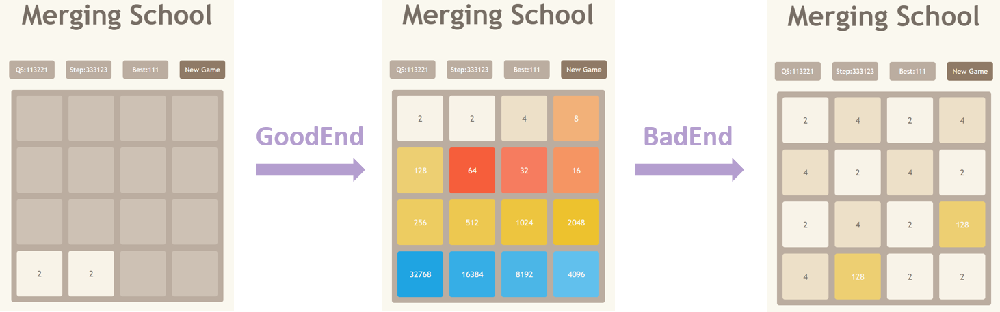
    * Please change the color of each grid to its corresponding color according to its value.
    * The colors are defined in `MergeSchool.css`. Please appreciate them but do not revise them! However, you should pay attend to the specific class name.
    * **HINT** Append specific class name to the variable `temp_class_name` in `Grid.js` mentioned above.
    * **HINT** The corresponding class name is in the format of `level-value`.

3. **[Easy] Mapping the numeric value to the corresponding school name (5%)**
    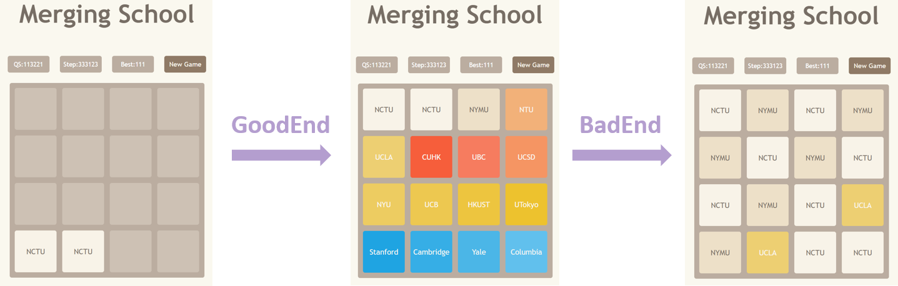

    * Probably you can show all the grids with the corresponding value in {2<sup>n</sup>, n∈[1,16]} and the color now.
    * Mapping them to the corresponding names of the schools. Please **directly** utilize the following mapping relationship.
    ```javascript
    const mapping = {'':"", 2:"NCTU", 4:"NYMU", 8:"NTU", 16:"UCSD", 32:"UBC", 64:"CUHK", 128:"UCLA", 256:"NYU",512:"UCB",1024:"HKUST", 2048:"UTokyo", 4096:"Columbia", 8192:"Yale", 16384:"Cambridge", 32768:"Stanford", 65536:"MIT"}
    ```
4. **[Easy] Enable moving in the "right" direction and changing of the "step" with the keyboard input (15%)**
    

    * If there is `right` keydown event on the `body`, make all the grids move right and combine some of them if there is any nearby pair in the horizontal direction.
    * Update the `step` if this movement is effective. That's, if nothing changes within the board after one movement, this step is ineffective and the `step` should NOT be updated.
    * *If you are interested in the PRNG, here is its usage. The pesudo random number is generated depending on the `step`. During the initial status, the first two grids are both generated by  `step = 0`. Then after one move, the next grid also is generated by `step = 0`. Then after the next move, the next grid is generated by `step = 1` ...etc.*
    * **HINT** Please add the event listener on the body
    ```javascript
    body = document.querySelector('body')
    ```
    * **HINT** Find the line `# 4 Implement yourself` in the `MergeSchool.js`.
    * **HINT** Modify the `checkAndUpdateAfterMove` function in the `MergeSchool.js` and the element with id of `general-step` in the `Header.js`.

5. **[Easy] Enable the [QS ranking](https://www.topuniversities.com/university-rankings/world-university-rankings/2021) update (5%)**
    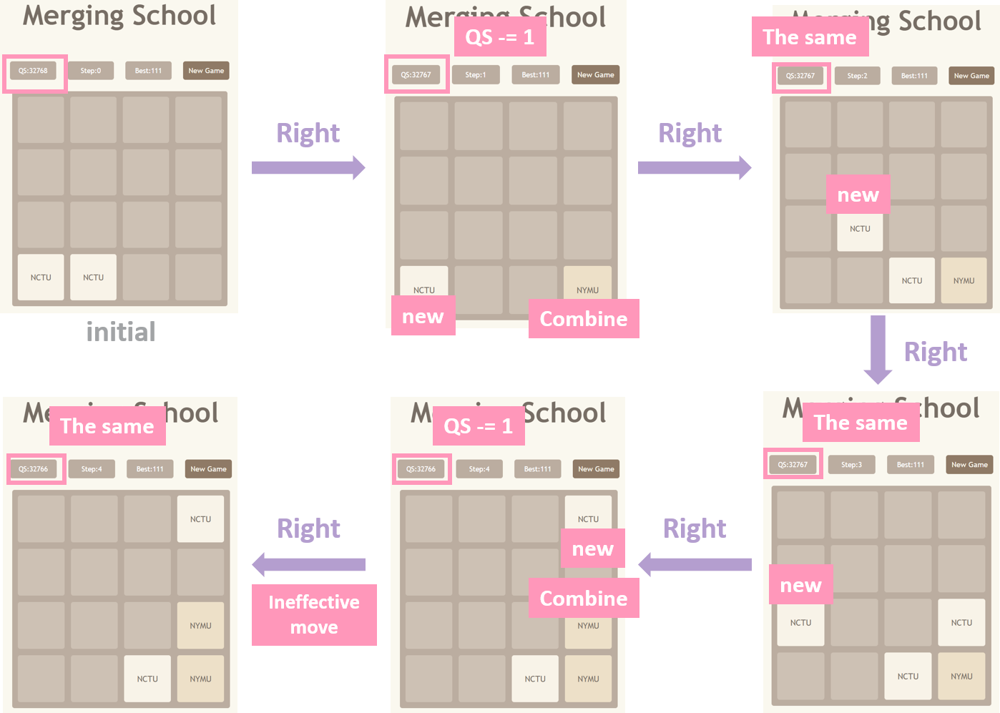

    * You should set the initial QS to `32768`. 
    * If there is one school combination occcuring during one move, the QS should subtract one.
    * **HINT** Simply modify the `checkAndUpdateAfterMove` function in `MergeSchool.js` and the element with id of `general-qs-ranking` in `Header.js`.

6. **[Easy] Enable the New Game button (10%)**
    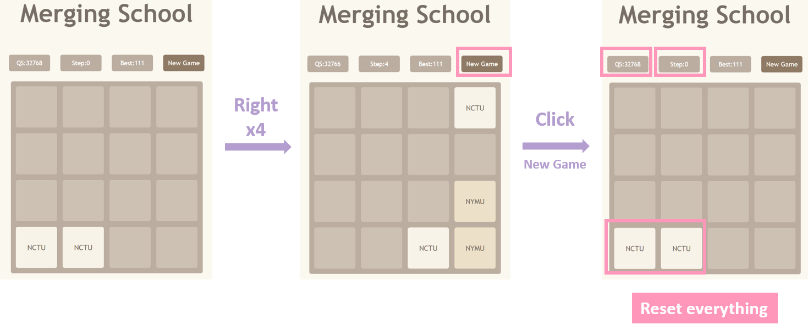

    * After you click the `New Game` button, the `step`, board, and `QS` should be set to the initial status.
    * **HINT** Modify the `initializeBoard` function in the `MergeSchool.js`.
    * **HINT** Pass this function to the element with id of `reset-button` in the `Header.js`.

7. **[Easy] Enable the recording of the best (i.e. lowest) QS ranking (5%)** 
    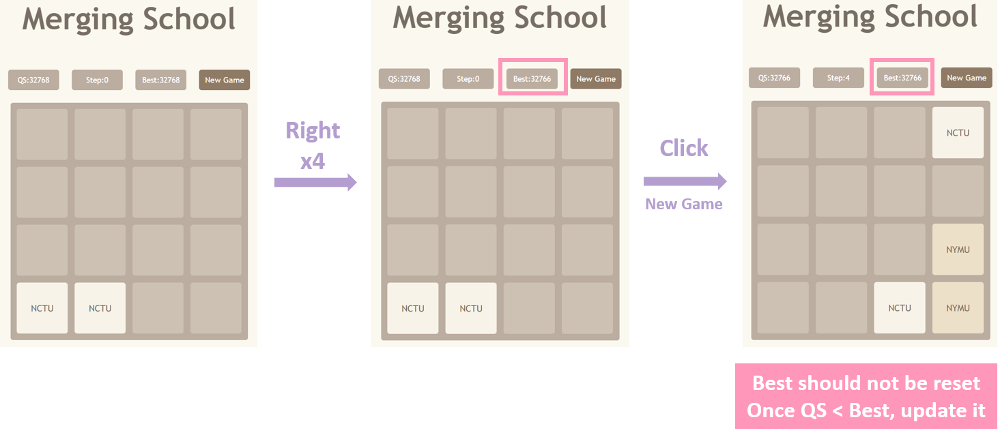

    * You should initialize the best QS to `32768` when initializing and refreshing the page.
    * Record the best QS during each step and each round. Please note that this value should not change when you click `New Game` but will if you **refresh the page**.
    * Once the current QS ranking is lower than the Best, update it.
    * **HINT** Modify the `checkAndUpdateAfterMove` function in the `MergeSchool.js` and the element with id of `best-qs-ranking` in the `Header.js`.

### Medium (35%)
8. **[Medium] Enable moving in all directions and with the corresponding records correctly (20%)**
    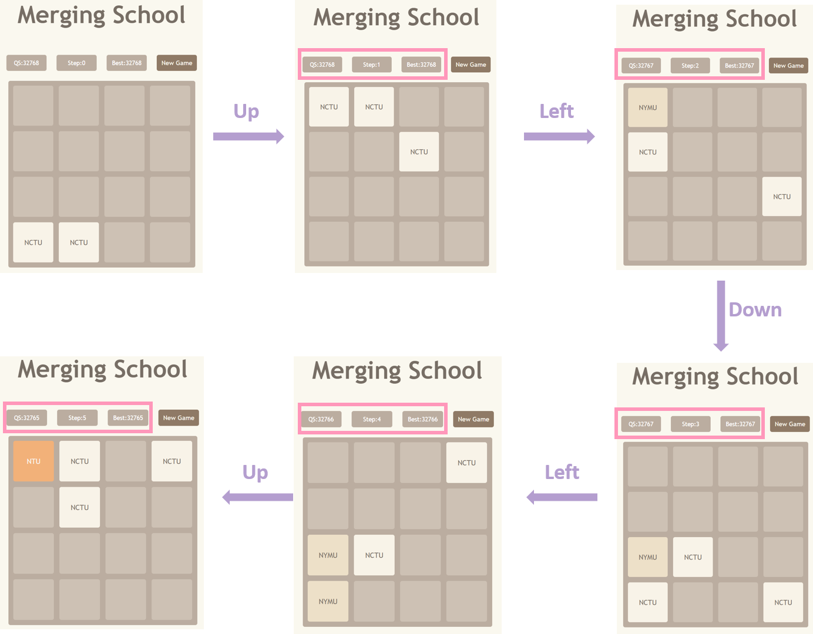

    * That is, you should allow keyboard input of `up`, `right`, `down`, and `left` and change the board accordingly. The records (`QS`, `Step`, and `Best`) should be updated correctly.
    * **HINT:** To move `up`, `down`, and `left`, you don't need to implement the sophisticated algorithm as the one in the `moveRight` function.
    * **HINT:** Combining the functions `rotateClockwise`, `rotateCounterClockwise`, and `moveRight` in the `MergeSchool.js` is enough!
    * **HINT:** Implement the `rotateCounterClockwise`, `moveLeft`, `moveDown`, and `moveUp` functions and modify the `moveGrid` and `handleKeyDown` functions in the `MergeSchool.js`. 
    * **HINT:** `keyCode = {Left: 37, Up: 38, Right: 39, Down: 40}`

9. **[Medium] Gameover detection (10%)**
    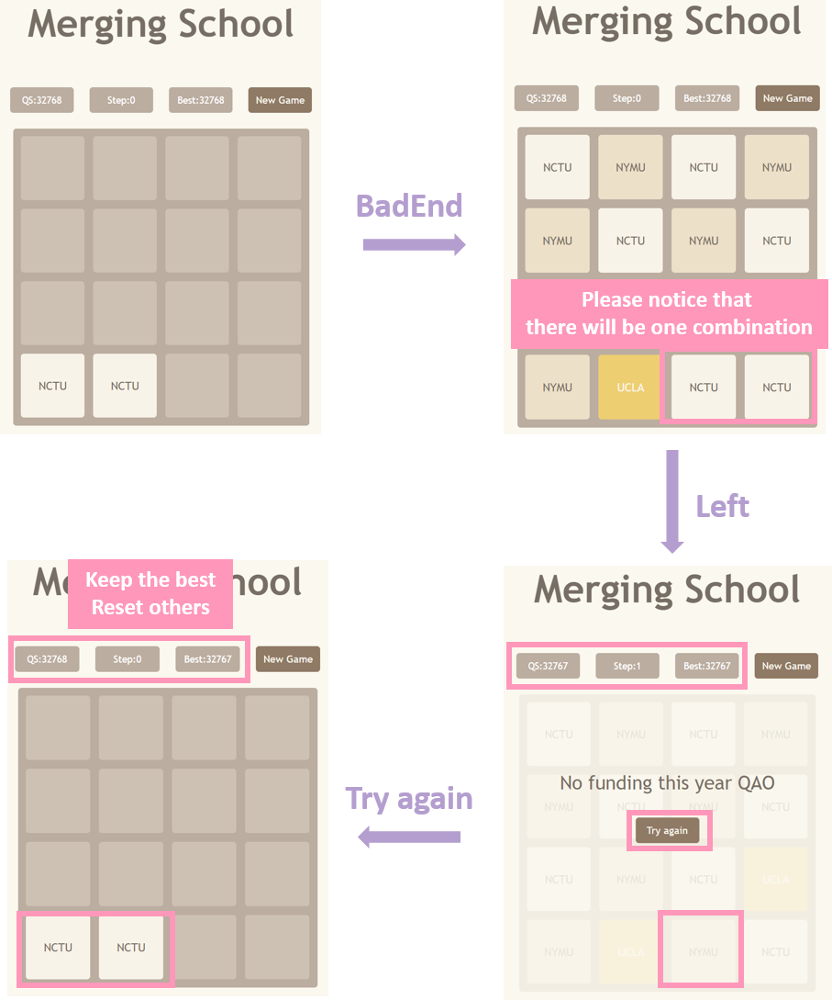

    * The definition of losing this game is if any movement will be ineffective to change the current board.
    * If in this scenario, make the board transparent and show up the message `No funding this year QAO` with the `Try again` button. You should also pass the `initializeBoard` function to the `Try again` button.
    * **HINT:** Implement the `checkGameover` function in the `MergeSchool.js` and use it somewhere to manipulate the `gameover` flag.
    * **HINT:** It is easy to leverage the `justifyMove` and four `Move` functions to check if one player loses the game or not.
    * **HINT:**  With the gameover flag, modify the `Board2048.js` to make the info show up and make the board transparent by appending `game-over-board` class and `game-over-wrapper` class to element with id `board-full` and element with id `game-over-info`, respectively.

10. **[Medium] Winning detection (5%)**
    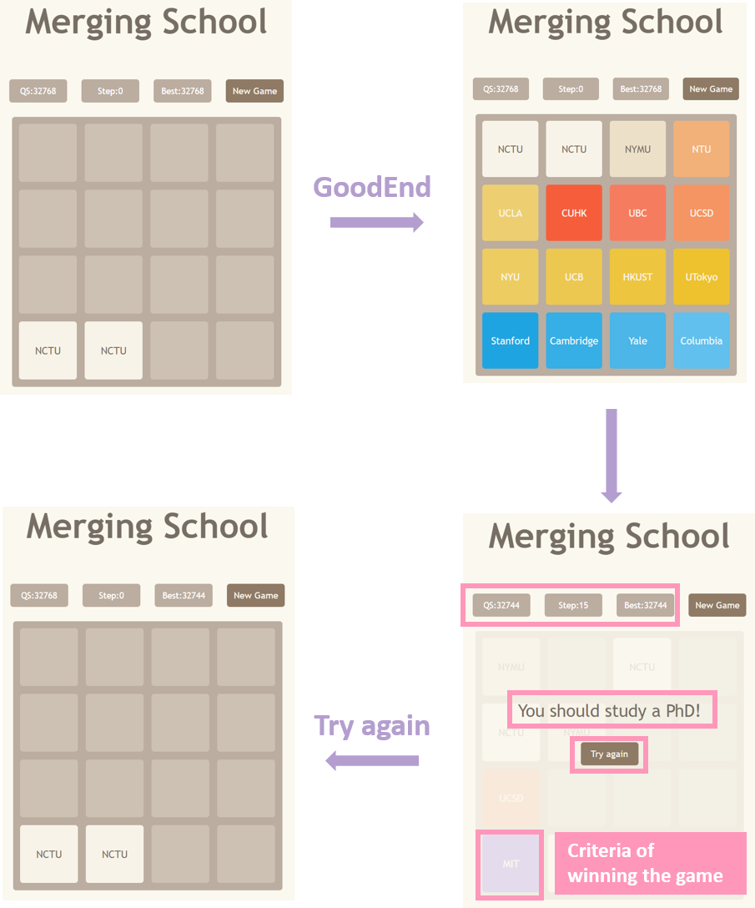

    * The definition of winning this game is if there is any `MIT` (=`65536`) presented in the board.
    * If there is, make the board transparent and show up the message `You should study a PhD!` with the `Try again` button.
    * **HINT:** Implement the `checkWin` function in the `MergeSchool.js` and use it somewhere to manipulate the `win` flag.
    * **HINT:**  With the `win` flag, modify the `Board2048.js` to change the sentence.

### Hard (15%)
11. **[Hard] When the player wins or loses the game, please gradually show the message (1%)**
    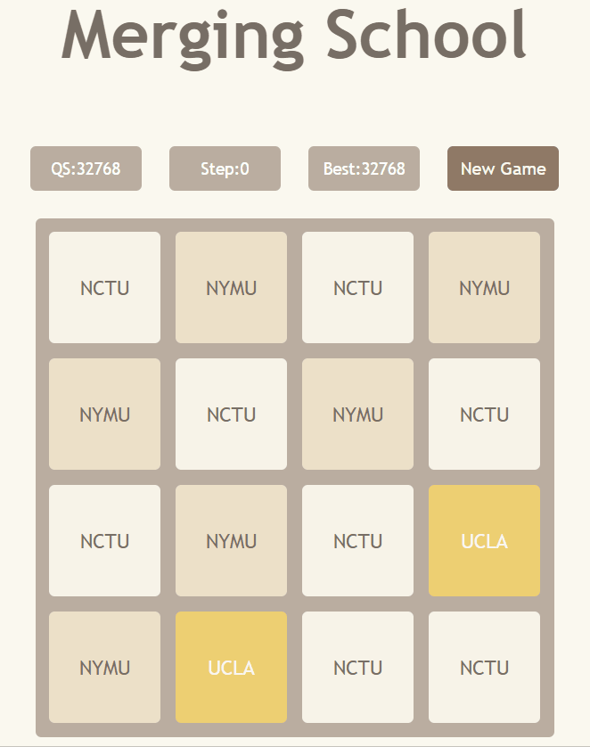

    * Rapidly showing up the gameover message is actually ruthless and would petrify the player! Let's gradually show it up.
    * **HINT:** Nothing but just add the `end-fade-in` class to the element with id of `game-over-info`.

12. **[Hard] If one grid is newly generated, make a fade-in animation for it (14%)**
    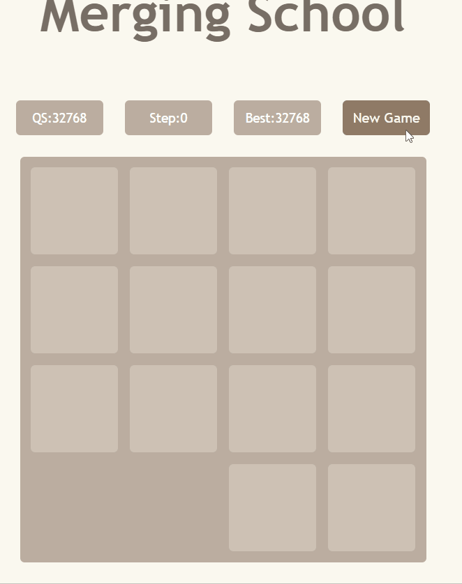

    * You might find that it is hard to discriminate which grids are just generated and which are the combinations of the previous ones.
    * Therefore, let's ornament those newly generated grids with the fade-in animation!
    * To simply this problem, it is normal that if the new grid overlaps the previous one, then there would be no animation. Don't be nervous.
    * **Important:** Please note that when you **refresh the page or start a new game**, the **initial two grids, `#grid-3-0` and `#grid-3-1`, should have fade-in animation**.
    * **HINT:** Just append the `school-fade-in` class to the newly generated grid.
    * **HINT:** You can maintain a new matrix to record which grid is newly generated. 
    * **HINT:** Edit the `putGridRandom` function might be helpful??

## Running Tests
1. Run `npm start` or `yarn start` first and make sure you are running your app using `localhost:4000`. If not, close the application that occupies this port.

2. Open another terminal, run `npm test` or `yarn test`. You should see the test results.

3. If you finish all the subproblems and everything goes well, you will see the following output:
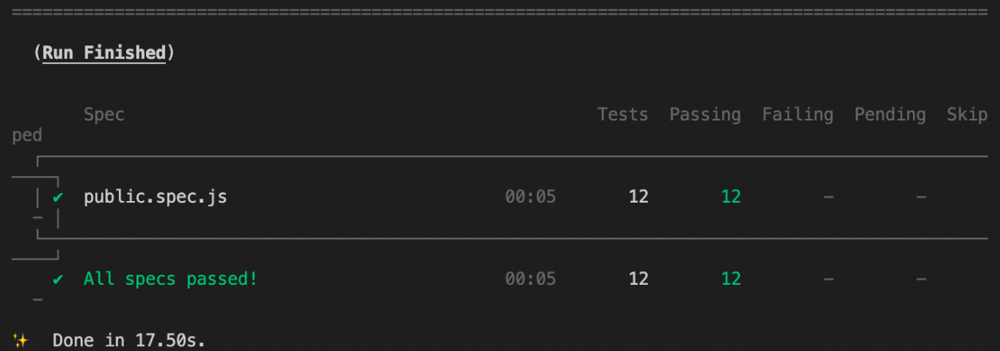

4. Please note that we will grade the medium and hard subproblems with some hidden tests. You will get the full score of these subproblems only if you pass all the public as well as the hidden tests. The public ones only account for 50% of the tests. You will get half score if you only pass the public tests.

## Push your code to Github
```
cd wp1092
git add hack2
git commit -m "your commit"
git push
```

## Copyright
Copyright © 2021 Ming-Yang, Ho. All rights reserved.
